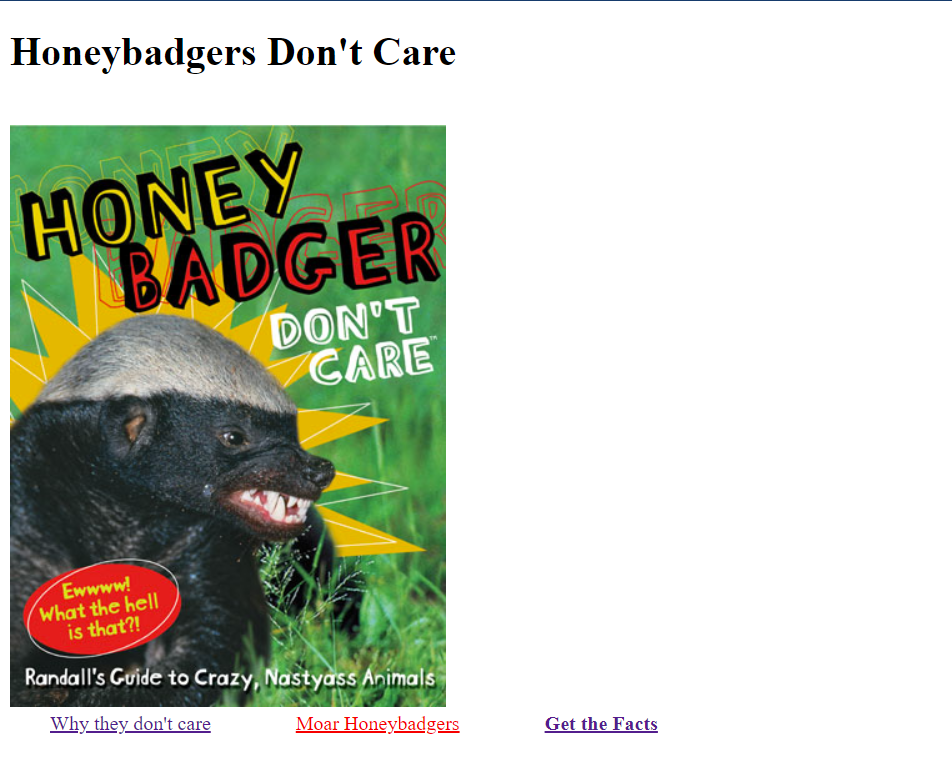

# Create a Page from Scratch

## Instructions
In a new html file, create the basic structure of an html page including:
1. DOCTYPE declaration
2. Header title
3. H1 tag showing the title 
3. embed an image of the topic you've chosen
4. create three links:
    - one is bold
    - one is red
    - one opens in a new tab

## Reference Photo
Basic:

Extras:

Dark Mode:

### Extras
- create an unordered list
- create an ordered list
- create a table with two columns
    - first column with favorite things about topic
    - second column with least favorite things about topc
- embed a youtube video
- style with flexbox
- style it in dark mode

### Hints
- target="_blank"
- w3 schools is your friend in this
- [flexbox docs](https://css-tricks.com/snippets/css/a-guide-to-flexbox/)